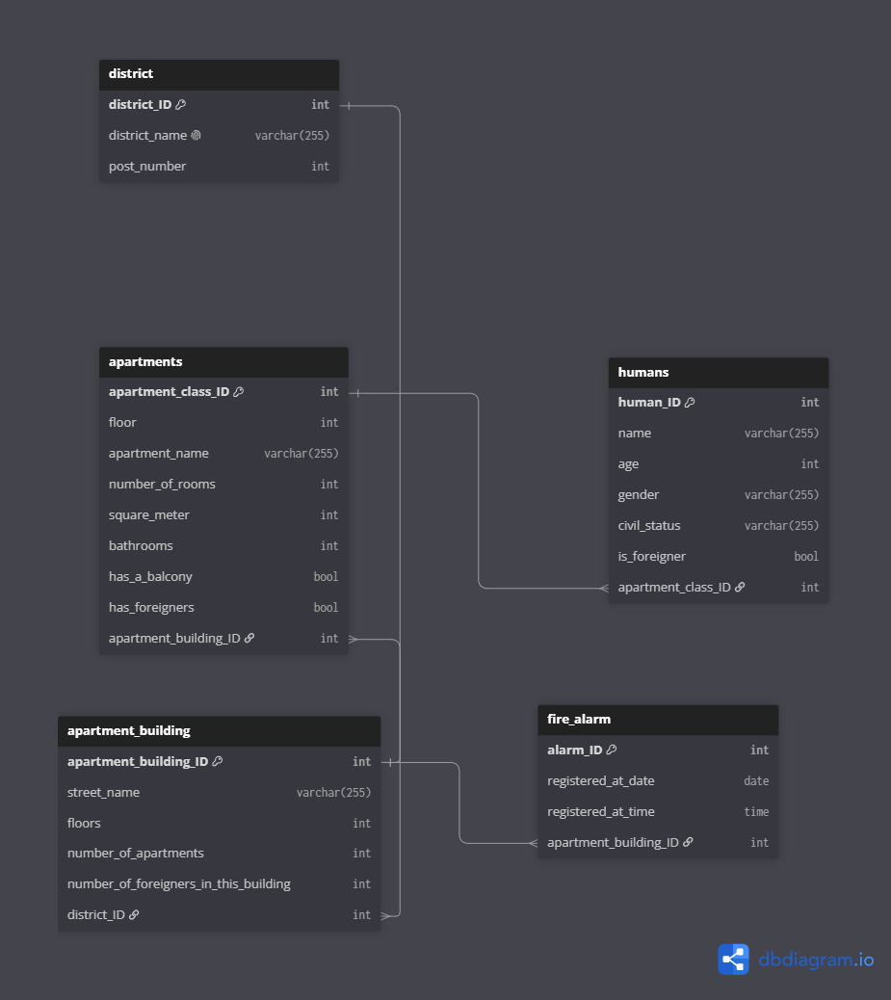

# Collection Program REST API

A [FastAPI](https://fastapi.tiangolo.com/) REST API for managing a housing/apartment collection program — districts, apartment buildings, apartments, residents, and fire alarm records — backed by MySQL (via SQLAlchemy) and Redis.

## Data model

The API is built around five related entities:

- **District** — a district with a name and postal code, containing apartment buildings.
- **Apartment Building** — belongs to a district; tracks street name, floor count, apartment count, and foreigner count; has apartments and fire alarms.
- **Apartment** — belongs to an apartment building; tracks floor, room count, size, bathrooms, balcony, and whether foreigners live there; has residents.
- **Human** — a resident linked to an apartment; tracks name, age, gender, and civil status.
- **Fire Alarm** — a fire alarm event linked to an apartment building, with the date and time it was registered.



## Tech stack

- **FastAPI** — web framework and interactive docs (served at `/`)
- **SQLAlchemy 2.0** — ORM, with both sync and async sessions
- **MySQL** — primary database (`mysql-connector-python` sync, `aiomysql` async)
- **Redis** — available for caching (sync and async connection helpers)
- **Uvicorn** — ASGI server
- **Docker** — containerized deployment

## Project structure

```
apartments/    apartment & apartment building models, schemas, CRUD, routes
districts/     district models, schemas, CRUD, routes
humans/        resident models, schemas, CRUD, routes
fire_alarms/   fire alarm model
database/      SQLAlchemy base, engine, and session configuration
docs/          ER diagram and other documentation assets
main.py        FastAPI app setup and router registration
```

Each domain module follows the same layout: `model.py` (SQLAlchemy model), `schemas.py` (Pydantic request/response schemas), `crud/` (database access functions), and `handler.py` (API routes).

## Getting started

### Prerequisites

- Python 3.11+
- A MySQL database
- (Optional) Redis, if caching is used

### Setup

1. Clone the repository and install dependencies:

   ```bash
   pip install -r requirements.txt
   ```

2. Create an `env_vars.env` file in the project root with your database configuration:

   ```env
   DATABASE_HOST=<your-database-host>
   DATABASE_PORT=<your-database-port>
   DATABASE_USER=<your-database-user>
   DATABASE_USER_PASSWORD=<your-database-password>
   DATABASE_NAME=<your-database-name>
   ```

   > **Never commit real credentials.** `env_vars.env` is listed in `.gitignore` — keep it that way.

3. Run the API locally:

   ```bash
   uvicorn main:app --reload
   ```

4. Open [http://127.0.0.1:8000/](http://127.0.0.1:8000/) for the interactive Swagger docs.

### Running with Docker

```bash
docker build -t collection_program_restapi .
docker run -d -e PYTHONUNBUFFERED=1 --env-file env_vars.env --name collection_program -p 5080:80 collection_program_restapi
```

View logs:

```bash
docker logs --tail 100 -f collection_program
```

Stop and remove the container:

```bash
docker stop collection_program
docker rm collection_program
```

See [docker_commands_windows_mode.txt](docker_commands_windows_mode.txt) for a Windows-specific version with auto-reload support.

## API overview

| Method | Endpoint | Description |
|---|---|---|
| GET | `/apartments/show_all_apartments` | List all apartments |
| GET | `/apartments/get_info_about_one_apartment/{apartment_name}` | Get info about one apartment |
| POST | `/apartments/create_a_new_apartment` | Create a new apartment |
| GET | `/districts/show_all_districts` | List all districts |
| POST | `/districts/create_a_new_district` | Create a new district |

Full, always-up-to-date API documentation is available at the root URL (`/`) once the server is running.
